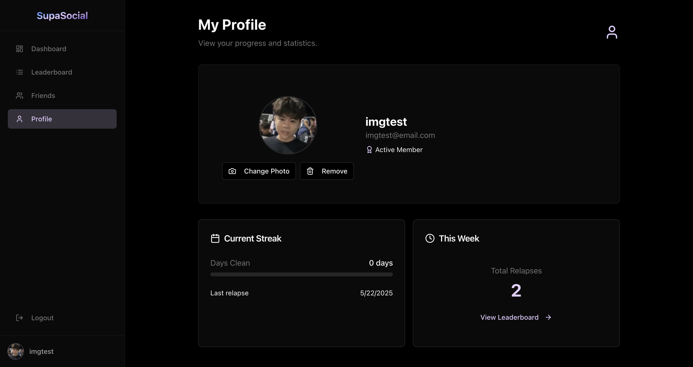
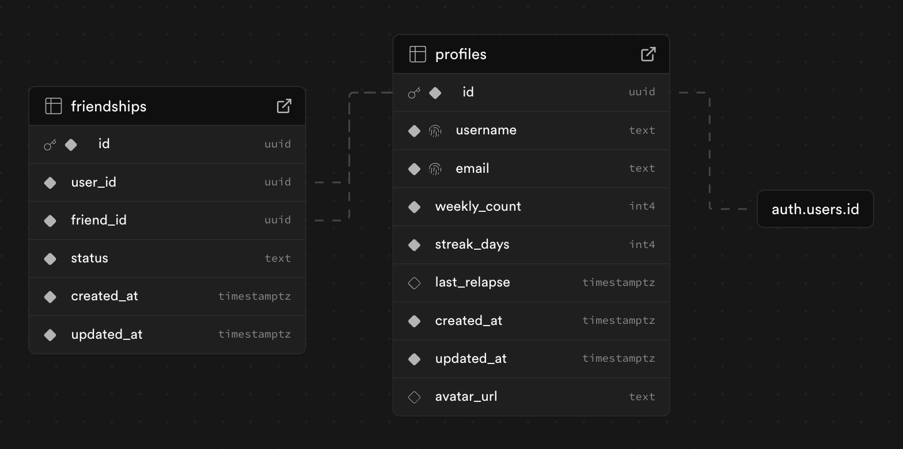

# SupaSocial - Supabase + React Social Media Starter

A modern social media web application starter template built with React, Supabase, Zustand, and Tailwind CSS. This template provides a solid foundation for building social networking applications with features like user authentication, friend management, profiles, and real-time interactions. 

> [!NOTE]
> This project is listed on [Awesome Supabase](https://github.com/lyqht/awesome-supabase?tab=readme-ov-file)

Also a quick note, the Supabase project is paused at the moment - everything would work fine w your proj :) 

## 🌟 Overview



SupaSocial is a feature-rich social media starter that includes:

- **User Authentication** - Sign up, sign in, and secure session management
- **User Profiles** - Customizable profiles with avatars and user tracking
- **Friend System** - Send/accept friend requests and manage friendships
- **Dashboard** - Personal activity tracking with streak counters
- **Leaderboard** - Competitive rankings and progress tracking
- **Real-time Updates** - Live data synchronization using Supabase Realtime
- **Modern UI** - Beautiful interface built with shadcn/ui and Tailwind CSS
- **Type Safety** - Full TypeScript support with generated database types
- **State Management** - Efficient state handling with Zustand

## 🏗️ Database Structure



The application uses two main tables and bucket storage

### Profiles Table
- `id` (UUID) - Primary key, linked to auth.users
- `username` (TEXT) - Unique username
- `email` (TEXT) - User email address
- `weekly_count` (INTEGER) - Weekly activity counter
- `streak_days` (INTEGER) - Current streak tracking
- `last_relapse` (TIMESTAMPTZ) - Last activity reset timestamp
- `avatar_url` (TEXT) - Profile picture URL, linked to storage bucket
- `created_at` & `updated_at` (TIMESTAMPTZ) - Timestamps

### Friendships Table
- `id` (UUID) - Primary key
- `user_id` (UUID) - Friendship requester
- `friend_id` (UUID) - Friendship recipient
- `status` (TEXT) - Either 'pending' or 'accepted'
- `created_at` & `updated_at` (TIMESTAMPTZ) - Timestamps

### Storage Bucket
- `avatars` - Profile pictures

## 🚀 Getting Started

### Prerequisites

- Node.js 18+ or Bun
- A Supabase account
- Git

### For Vibe Coders 💫

- [Supabase MCP](https://supabase.com/docs/guides/getting-started/mcp): Interact with your Supabase database from Cursor, Claude, etc.
- [Context7 MCP](https://github.com/upstash/context7): Access documentation for anything (Supabase, Shadcn, Zustand, etc.)
- [Cursor Rules (frontend)](https://cursor.directory/optimized-nextjs-typescript-best-practices-modern-ui-ux): Use best practices for your frontend
    - **Note**: Make sure to specify React instead of Next.js 

### 1. Create Your Own Repository

There are two ways to get started with this template:

#### Option A: Use as Template (Recommended)
1. Click the green **"Use this template"** button and select **"Create a new repository"**
2. Clone your new repository:
```bash
git clone https://github.com/YOUR_USERNAME/YOUR_REPOSITORY_NAME.git
cd YOUR_REPOSITORY_NAME
```

#### Option B: Fork the Repository
1. Click the **"Fork"** button in the top-right corner
2. Clone your forked repository:
```bash
git clone https://github.com/YOUR_USERNAME/supabase-react-social-media-starter.git
cd supabase-react-social-media-starter
```

> **💡 Tip**: Using "Use this template" is recommended as it creates a clean repository without the template's commit history.

### 2. Install Dependencies

```bash
# Using npm
npm install

# Using bun (recommended)
bun install
```

### 3. Create a Supabase Project

1. Go to [supabase.com](https://supabase.com) and create a new project
2. Wait for the project to be fully set up
3. Note down your project URL and anon public key from Settings > API

### 4. Set Up the Database

Execute the following SQL in your Supabase SQL editor to create the required tables and policies:

```sql
-- Create profiles table
CREATE TABLE profiles (
    id UUID REFERENCES auth.users ON DELETE CASCADE,
    username TEXT UNIQUE NOT NULL,
    email TEXT UNIQUE NOT NULL,
    weekly_count INTEGER DEFAULT 0 NOT NULL,
    streak_days INTEGER DEFAULT 0 NOT NULL,
    last_relapse TIMESTAMPTZ,
    avatar_url TEXT,
    created_at TIMESTAMPTZ DEFAULT NOW() NOT NULL,
    updated_at TIMESTAMPTZ DEFAULT NOW() NOT NULL,
    PRIMARY KEY (id)
);

-- Create friendships table
CREATE TABLE friendships (
    id UUID DEFAULT gen_random_uuid() PRIMARY KEY,
    user_id UUID REFERENCES profiles(id) NOT NULL,
    friend_id UUID REFERENCES profiles(id) NOT NULL,
    status TEXT NOT NULL CHECK (status IN ('pending', 'accepted')),
    created_at TIMESTAMPTZ DEFAULT NOW() NOT NULL,
    updated_at TIMESTAMPTZ DEFAULT NOW() NOT NULL
);

-- Enable RLS
ALTER TABLE profiles ENABLE ROW LEVEL SECURITY;
ALTER TABLE friendships ENABLE ROW LEVEL SECURITY;
```

### 5. Configure Row Level Security (RLS) Policies

Run these SQL commands to set up the required security policies:

```sql
-- Profiles policies
CREATE POLICY "Users can view own profile" ON profiles
    FOR SELECT USING (auth.uid() = id);

CREATE POLICY "Users can insert own profile" ON profiles
    FOR INSERT WITH CHECK (auth.uid() = id);

CREATE POLICY "Users can update own profile" ON profiles
    FOR UPDATE USING (auth.uid() = id);

CREATE POLICY "Enable profile search for authenticated users" ON profiles
    FOR SELECT TO authenticated USING (auth.uid() IS NOT NULL);

CREATE POLICY "Users can view friends' profiles" ON profiles
    FOR SELECT USING (
        EXISTS (
            SELECT 1 FROM friendships 
            WHERE ((user_id = auth.uid() AND friend_id = profiles.id AND status = 'accepted') 
                OR (user_id = profiles.id AND friend_id = auth.uid() AND status = 'accepted'))
        )
    );

-- Friendships policies
CREATE POLICY "Users can view own friendships" ON friendships
    FOR SELECT USING (user_id = auth.uid() OR friend_id = auth.uid());

CREATE POLICY "Users can create friendship requests" ON friendships
    FOR INSERT WITH CHECK (user_id = auth.uid());

CREATE POLICY "Users can update received friendship requests" ON friendships
    FOR UPDATE USING (friend_id = auth.uid());

CREATE POLICY "Users can delete friendships" ON friendships
    FOR DELETE USING (user_id = auth.uid() OR friend_id = auth.uid());
```

### 6. Set Up Database Triggers

Create this trigger to automatically update the `updated_at` timestamp:

```sql
-- Create updated_at trigger function
CREATE OR REPLACE FUNCTION update_updated_at_column()
RETURNS TRIGGER AS $$
BEGIN
    NEW.updated_at = NOW();
    RETURN NEW;
END;
$$ language 'plpgsql';

-- Apply trigger to profiles table
CREATE TRIGGER update_profiles_updated_at BEFORE UPDATE ON profiles
    FOR EACH ROW EXECUTE FUNCTION update_updated_at_column();

-- Apply trigger to friendships table
CREATE TRIGGER update_friendships_updated_at BEFORE UPDATE ON friendships
    FOR EACH ROW EXECUTE FUNCTION update_updated_at_column();
```

### 7. Configure Environment Variables

Update the Supabase configuration in `src/integrations/supabase/client.ts`:

```typescript
const SUPABASE_URL = "YOUR_SUPABASE_PROJECT_URL";
const SUPABASE_PUBLISHABLE_KEY = "YOUR_SUPABASE_ANON_KEY";
```

Replace:
- `YOUR_SUPABASE_PROJECT_URL` with your project URL (e.g., `https://xyz.supabase.co`)
- `YOUR_SUPABASE_ANON_KEY` with your anon public key

### 8. Customize Your Application

#### Update Application Details
- Change the project name in `package.json`
- Update the app title in `index.html`
- Replace the favicon and social media images in the `public` folder

#### Modify Features for Your Use Case
- Update the dashboard metrics in `src/pages/Dashboard.tsx`
- Customize profile fields in `src/pages/Profile.tsx`
- Modify the leaderboard criteria in `src/pages/Leaderboard.tsx`
- Adjust the friend system behavior in `src/stores/friendsStore.ts`

### 9. Run the Development Server

```bash
# Using npm
npm run dev

# Using bun
bun dev
```

Your application will be available at `http://localhost:5173`

## 🔐 Security Considerations

### Row Level Security (RLS)
The application implements comprehensive RLS policies to ensure:
- Users can only view and edit their own profiles
- Friend profiles are only visible to accepted friends
- Friendship requests are properly validated
- All data access is authenticated

### Authentication
- Session management is handled securely by Supabase Auth
- Passwords are hashed and stored securely
- JWT tokens are used for API authentication

## 🛠️ Technology Stack

- **Frontend**: React 18, TypeScript, Vite
- **Backend**: Supabase (PostgreSQL, Auth, Realtime)
- **State Management**: Zustand
- **UI Components**: shadcn/ui, Radix UI
- **Styling**: Tailwind CSS
- **Routing**: React Router DOM
- **Forms**: React Hook Form with Zod validation
- **Data Fetching**: TanStack Query

## 📁 Project Structure

```
src/
├── components/          # Reusable UI components
├── hooks/              # Custom React hooks
├── integrations/       # Supabase client and types
├── lib/                # Utility functions
├── pages/              # Page components
├── stores/             # Zustand state stores
└── App.tsx             # Main application component
```

## 🚀 Deployment

### Using Vercel (Recommended)
1. Connect your repository to Vercel
2. Set environment variables if needed
3. Deploy automatically on git push

### Using Netlify
1. Connect your repository to Netlify
2. Build command: `npm run build`
3. Publish directory: `dist`

## 🤝 Contributing

1. Fork the repository
2. Create a feature branch
3. Make your changes
4. Test thoroughly
5. Submit a pull request

## 📝 License

This project is open source and available under the [MIT License](LICENSE).

## 🆘 Support

If you encounter any issues:
1. Check the browser console for errors
2. Verify your Supabase configuration
3. Ensure RLS policies are properly set up
4. Check that all required tables exist

For additional help, please open an issue in the repository.

---

**Made with ❤️** Build cool stuff with this starter template.
